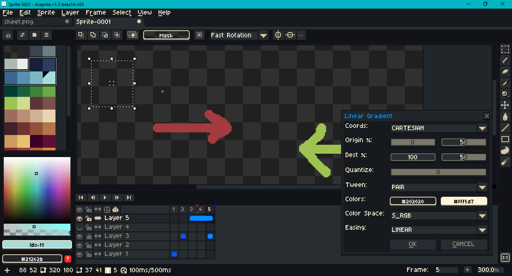

# Aletheia



A dark theme for Aseprite. Tested with version 1.3.

## Installation

Themes are typically packaged in a `.zip` file which is then changed to an `.aseprite-extension`. For ease of maintenance and installation, the contents of this repo are not packaged. For more about themes, including installation instructions, see the [documentation](https://www.aseprite.org/docs/extensions/themes/).

## Key Differences

- Highlight blue is more saturated.
- Wider sprite tabs.
- Ink type icons (shading, etc.).
- Cursors:
  - Smaller general.
  - Smaller transform: rotate, scale, skew.
- Dialogs:
  - Distinct selected radio buttons.
  - Combo box menu dimensions.
- Home:
  - Aseprite face icon is same as light theme.
- Palette:
  - Sort menu icon.
  - Preset dropdown link icons.
- Timeline:
  - Open padlock for editable layers.
  - Empty cels do not have circles.
  - Red-blue color onion skin frame on timeline.
  - Gear and onion skin icons.
- Tools:
  - Paint bucket.

## Scale

This theme is designed for 100% `Screen Scaling`, 200% `UI Elements Scaling`. These can be changed under `Edit > Preferences > General`. If some UI elements do not change after the theme is `Select`ed in `Edit > Preferences > Theme`, go to `View > Refresh & Reload Skin`.

## Font

This theme is not distributed with its own font. If you wish to change the font, add `Aletheia` to Aseprite first. Then go to `Edit > Preferences > Theme`, select `Aletheia` and click the `Open Folder` button. Place the font files in this folder. Open the `theme.xml` file and look for the `<fonts>` tag near the top. Comment out the original entries

```xml
<fonts>
  <!-- <font id="default" font="Aseprite" /> -->
  <!-- <font id="mini" font="Aseprite Mini" /> -->
</fonts>
```

and replace them with your preference.

```xml
<fonts>
  <font id="default" name="FiraCode-Regular" type="truetype" file="FiraCode-Regular.ttf" antialias="true" size="6" />
  <font id="mini" name="FiraCode-Regular" type="truetype" file="FiraCode-Regular.ttf" antialias="true" size="5" />
</fonts>
```

The example above uses [Fira Code](https://github.com/tonsky/FiraCode).

## Palette Swatch Size

Palette swatch size is not controlled by a theme. To change it, go to `Edit > Preferences`, then under the `General` tab, click on the link `Locate Configuration File`. This will direct you to `aseprite.ini`. Open this file in a text or code editor. Search for `[color_bar]`. Under this heading, change or create the entry `box_size`. The accepted values are between 4 and 32, e.g., `box_size = 24`. Alternatively, use a [Lua script](https://www.aseprite.org/api/):

```lua
local dlg = Dialog { title = "Palette Swatch Size" }
dlg:slider {
    id = "swatchSize",
    label = "Size: ",
    min = 4,
    max = 32,
    value = app.preferences.color_bar.box_size,
    onchange= function()
        app.command.SetPaletteEntrySize { size = dlg.data.swatchSize }
    end
}
dlg:check {
    id = "useSeparator",
    label = "Enable: ",
    text = "Separator",
    value = app.preferences.color_bar.entries_separator,
    onclick = function()
        app.preferences.color_bar.entries_separator = dlg.data.useSeparator
    end
}
dlg:button {
    id = "cancel",
    text = "&CANCEL",
    focus = false,
    onclick = function()
        dlg:close()
    end
}
dlg:show { wait = false }
```