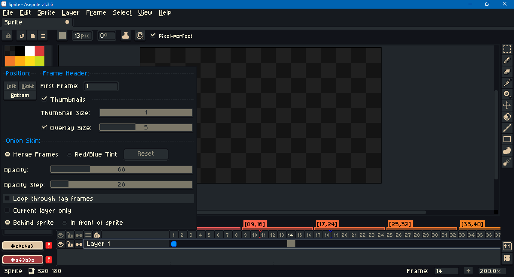

# Aletheia



A dark theme for Aseprite. Tested with version 1.3 beta. For more about themes, including installation instructions, see the [documentation](https://www.aseprite.org/docs/extensions/themes/). This theme is designed for 100% `Screen Scaling`, 200% `UI Elements Scaling`. These can be changed under `Edit > Preferences > General`. If some UI elements do not change after the theme is `Select`ed in `Edit > Preferences > Theme`, go to `View > Refresh & Reload Skin`.

Key differences:
- Highlight blue is more saturated.
- Wider sprite tabs.
- Ink type icons (shading, etc.).
- Cursors:
  - Smaller general.
  - Smaller transform: rotate, scale, skew.
- Dialogs:
  - Distinct selected radio buttons.
  - Combo box menu dimensions.
- Home:
  - Aseprite face icon is same as light theme.
- Palette:
  - Sort menu icon.
  - Preset dropdown link icons.
- Timeline:
  - Open padlock for editable layers.
  - Empty cels do not have circles.
  - Red-blue color onion skin frame on timeline.
  - Gear and onion skin icons.
- Tools:
  - Paint bucket.

This theme is not distributed with its own font. If you wish to change the font, add `Aletheia` to Aseprite first. Then go to `Edit > Preferences > Theme`, select `Aletheia` and click the `Open Folder` button. Place the font files in this folder. Open the `theme.xml` file and look for the `<fonts>` tag near the top. Comment out the original entries

```xml
<fonts>
  <!-- <font id="default" font="Aseprite" /> -->
  <!-- <font id="mini" font="Aseprite Mini" /> -->
</fonts>
```

and replace them with your preference.

```xml
<fonts>
  <font id="default" name="FiraCode-Regular" type="truetype" file="FiraCode-Regular.ttf" antialias="true" size="6" />
  <font id="mini" name="FiraCode-Regular" type="truetype" file="FiraCode-Regular.ttf" antialias="true" size="5" />
</fonts>
```

The example above uses [Fira Code](https://github.com/tonsky/FiraCode).